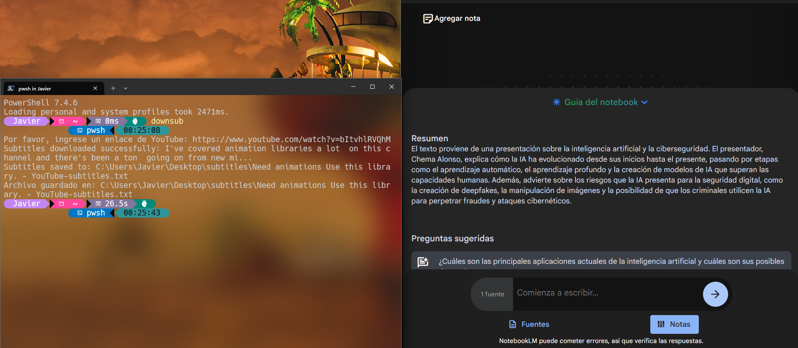

# Puppeteer YouTube Subtitle Downloader



## Overview
Puppeteer YouTube Subtitle Downloader is a Node.js application that automates the process of downloading subtitles from YouTube videos. This tool is particularly useful for extracting subtitles from long videos (approximately 1 hour) and then passing the text to [NotebookLM](https://notebooklm.google.com/) for summarization and interaction.

## Features

- Extracts video ID from YouTube URLs.
- Downloads subtitles from YouTube videos using Puppeteer.
- Saves the subtitles to a text file on your desktop.
- Ideal for summarizing long videos and interacting with the text.

## Prerequisites

- Node.js installed on your machine.
- A stable internet connection.

## Installation

1. Clone the repository:
    ```sh
    git clone https://github.com/javiermedinaj/bash-js
    ```
2. Navigate to the project directory:
    ```sh
    cd bash-js
    ```
3. Install the dependencies:
    ```sh
    npm install
    ```

## Extra

A batch file (`downsub.bat`) is included for easy command-line usage:

1. Add the script location to your system's PATH, or
2. Run the script directly:
    ```sh
    downsub.bat <youtube-url>
    ```